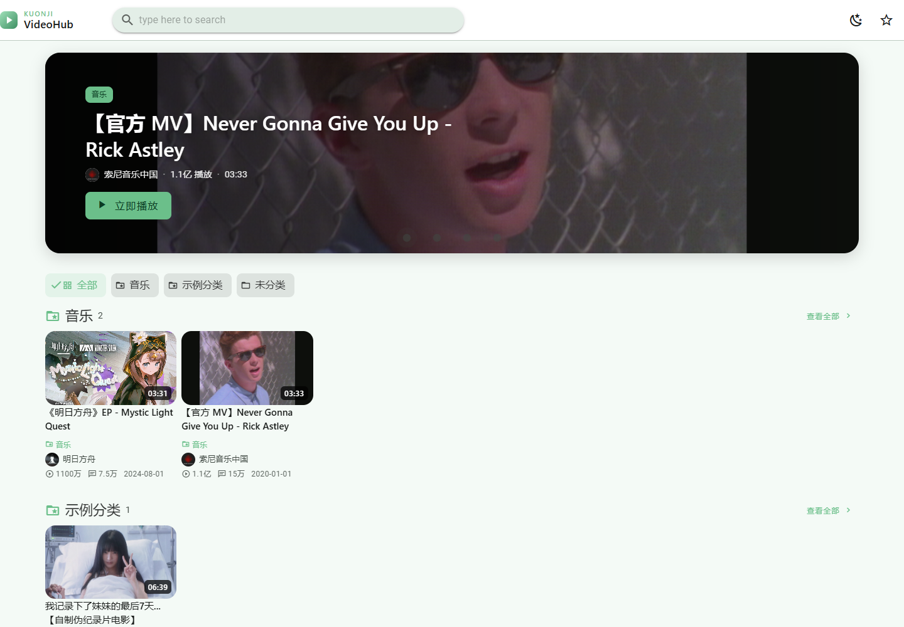
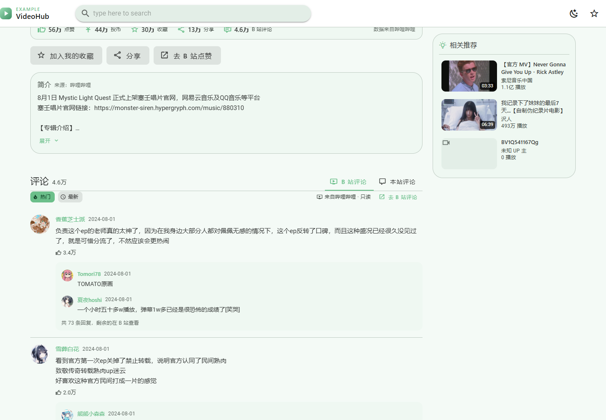
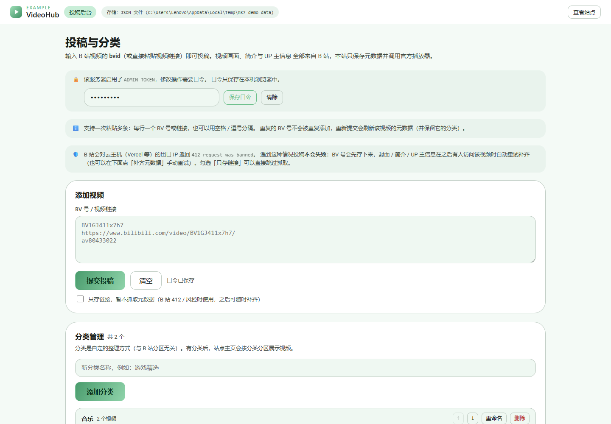
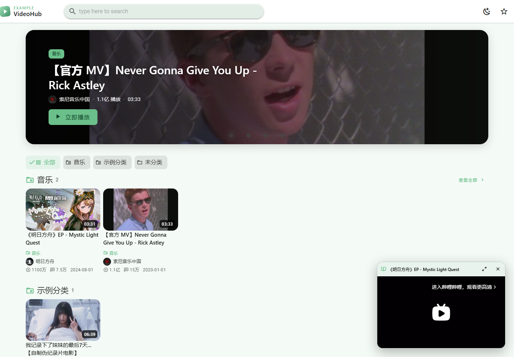
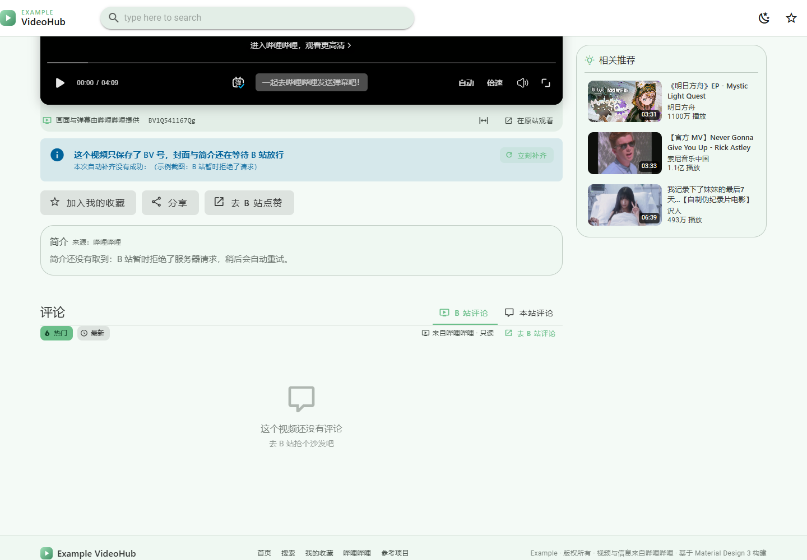

# Kuonji

其实是自己用来分享视频的网站吧，用dsh写的，如果有类似的需求可以试试吧

## 它是什么

一个用 **Material Design 3** 做的视频站点，界面结构仿照
[KotokawaAkira/VideoStation](https://github.com/KotokawaAkira/VideoStation)，
内容全部来自哔哩哔哩：**投稿就是填一个 bvid**，播放走 B 站官方内嵌播放器，
简介 / UP 主 / 分区 / 统计 / 评论都从 B 站读并且没有账号系统，完美符合“分享”两个字

> 站点名 / 主色 / 图标 / 背景都由仓库根目录的 `config.json` 配置（导航栏 / 页脚 / HTML 标题 / `/admin` 全部读它）。
> 
> 安装、投稿、分类、部署、元数据兜底、API 示例与验证脚本：见 **[TUTORIAL.md](TUTORIAL.md)**。

---

## 界面截图



*首页：顶部分类 chip，下面每个分类一个区块；封面、播放量、UP 主、分区都来自 B 站，右上角可切换亮 / 暗主题。*

| 视频页 | 投稿后台 |
| --- | --- |
|  |  |
| 简介、点赞投币收藏统计、相关推荐，以及**真实的 B 站评论**（热门 / 最新、楼中楼） | 粘贴 bvid 投稿、分类管理，每条可刷新 / 补齐元数据；带「待补齐」标记与占位封面 |

| 小窗播放 | 待补齐（只存了 bvid） |
| --- | --- |
|  |  |
| 切到别的页面时播放不中断，自动缩成右下角小窗，可「回到视频页」或「关闭小窗」 | B 站返回 412 时先只存 bvid，之后自动 / 手动补齐，期间不会伪造 UP 主与统计 |

---

## 快速开始

```bash
npm install
npm run serve        # 构建前端 + 启动 Node 服务
```

| 地址 | 说明 |
| --- | --- |
| http://127.0.0.1:8787/ | 站点首页 |
| http://127.0.0.1:8787/admin | **投稿后台**（投稿 + 分类管理） |
| http://127.0.0.1:8787/api/health | 服务状态、存储驱动、是否需要口令 |

开发模式（前端热更新，API 代理到 8787）：

```bash
npm run start        # 终端 1：Node 服务
npm run dev          # 终端 2：Vite，http://127.0.0.1:5173
```

---

## 小窗播放

播放器**只在 App 顶层挂载一次**，然后靠定位在「页面内」和「小窗」之间切换：

- 在视频页时，播放器用绝对定位精确贴合页面里的占位槽（`getBoundingClientRect` + 父级 `ResizeObserver` + 短暂重测），
  所以你看到的就是普通的内嵌播放器；
- 一旦离开视频页（去首页 / 搜索 / 收藏），占位槽消失，播放器自动变成右下角的小窗，
  带标题、**回到视频页**和**关闭小窗**两个按钮；
- 点「回到视频页」会重新贴合回去。

关键点：**跨域 iframe 一旦被移动或重建就会重新加载、播放进度归零**，所以实现上全程不移动、
不重建这个 iframe，只改它的定位——小窗和页面内播放的是同一个元素，声音和进度都不中断。
自动化测试里用「在元素上打一个 JS 标记，导航后标记仍在 + iframe src 未变」来验证这一点。

> 因为跨域限制，页面无法读取 iframe 的播放状态，所以小窗是「只要你打开过视频页就一直存在」，
> 而不是「只在真正播放时才出现」；暂停后不想看到它，点关闭即可。

---

## 投稿后台（/admin）

粘贴 **BV 号**、**av 号**或**完整视频链接**，点「提交投稿」：

```
BV1GJ411x7h7
https://www.bilibili.com/video/BV1GJ411x7h7/
av80433022
```

- **批量**：每行一个，或用空格 / 逗号分隔（顺序请求，间隔 350ms 降低风控概率）。
- **自动去重**：重复的 BV 号变成**刷新元数据**，并且**保留它的分类**。
- **失败有原因**：`视频不存在或已被删除`、`访问被拒绝（可能是番剧、付费或仅限登录的内容）`、
  `请求过于频繁，请稍后再试` 等。
- 每条记录可：**刷新元数据** / **站点预览** / **在 B 站打开** / **删除**。
- **「在本机抓取元数据」默认开启**：浏览器用自己的 IP 通过 JSONP 读 B 站，再
  `POST /api/videos/import` 把原始数据交给服务器归一化入库 —— **服务器完全不访问 B 站**，
  所以线上机房 IP 被 412 也照常投稿（唯一拿不到的是「标签」，B 站要求 Referer 为 bilibili.com）。
- **勾选「只存链接，暂不抓取元数据」**：连本机也不抓，先把 bvid 存下来，之后随时补齐 —— 见下一节。

### 元数据待补齐（只存 bvid）

B 站会对机房 IP（Vercel / 云主机）返回 `412 request was banned`，所以**投稿永远不会因为抓不到元数据而失败**：

1. **先存 bvid**：提交后立刻入库，记录标记为 `metadataState: "pending"`（标题暂时就是 bvid）。
2. **抓取链路**（按顺序尝试，任意一环成功即结束）：
   `/x/web-interface/view/detail`（含 tags）→ `/x/web-interface/view` → **视频页 HTML**
   （`https://www.bilibili.com/video/<bvid>/` 里的 `window.__INITIAL_STATE__.videoData`）。
   第三条走的是 `www.bilibili.com` 而不是 `api.bilibili.com`：本机家宽实测可用（标题 / 简介 / 封面 /
   UP 主 / 分 P / 数据全都有），但从线上机房发起实测**同样 412**（见下方实测）。
3. **自动重试**：任何访问者打开这条视频时，前端会调一次
   `POST /api/videos/:bvid/hydrate`（**不需要口令**，服务端做 20 秒 / 每个 bvid 的频率限制），
   成功后封面、简介、UP 主、分区、评论（aid）会立刻出现；
   失败则保持待补齐并记下原因，下次访问再试。
   B 站评论接口被调用时如果发现缺 `aid`，也会顺手把这套元数据补齐。
4. **后台手动**：卡片上有「补齐元数据」按钮，并有 `待补齐` 标记、上次失败原因、占位缩略图。

待补齐期间的 UI 不会"假装知道"：视频页显示提示条 + 「立刻补齐」按钮，**不显示 UP 主卡片、不显示全 0 的统计栏**，
简介位置写明"稍后会自动重试"；主页卡片用渐变占位封面 + `待补齐` 状态，视频本身照常播放。

> 实测：
> - **本机家宽 IP**：`接口 view/detail`、`接口 view`、视频页 HTML 三条链路都能用（HTML 那条能拿到完整元数据）。
> - **线上 hkg1 部署**：同一分钟内三条链路**一起** 412，后台会显示
>   `（本次尝试：接口 view/detail 412；接口 view 412；视频页 HTML 412）`——
>   即 B 站是按出口 IP 拦整个 `bilibili.com`，HTML 兜底救不了机房 IP。
>   此时记录保持 `待补齐`：拦截是**间歇性**的（同一天实测到过"线上投稿直接成功"），
>   之后有人访问会自动重试；想立刻就补齐，用下面的 `npm run sync`（推荐）或本地后台直连线上 KV。

### 本地补齐后上传（`npm run sync`）

线上机房 IP 抓不到元数据时，最省事的补救是**用本机的家宽 IP 抓，再把结果传到线上**。
上传走本站自己的 `POST /api/videos/import` 接口（只接受白名单字段、需要 `ADMIN_TOKEN`），
**完全不经过 B 站**，所以线上能不能访问 B 站都不影响。

```bash
# 从这台机器访问 *.vercel.app 需要走系统代理（本机 DNS 的问题）
$env:HTTPS_PROXY="http://127.0.0.1:7897"; $env:HTTP_PROXY="http://127.0.0.1:7897"; $env:NODE_USE_ENV_PROXY="1"

npm run sync -- list      # 1. 看线上有哪些视频、哪些缺元数据（默认命令）
npm run sync -- hydrate   # 2. 本机抓 B 站 → 补齐并写入本地库
npm run sync -- push      # 3. 上传到线上 + 回读校验
npm run sync -- run       # 上面三步一条龙

# 只想处理某几条 / 演练
npm run sync -- hydrate --bvids BV1QJ411m7fy
npm run sync -- run --base http://127.0.0.1:8787 --dry
```

`list` 的输出：

```
线上：https://your-app.vercel.app
存储：Upstash Redis / Vercel KV · 可写 · 口令：已启用
视频 8 个 / 分类 2 个

#  状态     bvid           标题                              UP 主         分类      缺失
------------------------------------------------------------------------------------------------
1  ⏳ 待补齐 BV1QJ411m7fy   BV1QJ411m7fy                      -             -         封面,UP主,aid,…
2  ✅ 完整  BV1Ky411q7QC   《明日方舟》EP - Mystic Light Que…明日方舟      音乐

汇总：8 个视频，其中 1 个需要补齐
  下一步：npm run sync -- run
```

参数与行为：

| 参数 | 作用 |
| --- | --- |
| `--base <url>` | 目标实例（默认 `LIVE_BASE` 或线上地址；可用 `http://127.0.0.1:8787` 演练） |
| `--all` | 连完整的记录也重新抓一遍（刷新播放量 / 分 P） |
| `--bvids A,B` | 只处理指定 bvid（可以是线上还没有的，等于"本地补好再投上去"） |
| `--limit N` / `--delay ms` | 限制条数 / 抓取间隔（默认 1200ms，降低被 B 站限流的概率） |
| `--dry` / `--no-store` | 只演练 / 不写本地库（只在内存里补齐） |
| `--direct` / `--local <url>` | 强制直接写本地 JSON / 指定本地服务地址（默认 `http://127.0.0.1:8787`） |
| `--with-collection` | 连分类一起覆盖线上（**默认不动线上策展的分类**） |
| `--json` | `list` 输出 JSON，便于脚本消费 |

- `hydrate` 会把结果写进本地库，所以本地库同时是一份线上镜像；
  需要更新提交版 seed 时再跑 `npm run seed:export`。
- **本地服务在运行时（`npm run start`），`hydrate` 会自动改成调用它的 HTTP 接口**，
  而不是直接改 `server/data/videos.json`：服务进程持有一份内存缓存，
  直接改文件会在它下一次写入（归类 / 删除 / 投稿）时被整份覆盖。用 `--direct` 可以强制直接写文件，
  这种情况脚本会打印警告。
- `push` 之后会**回读线上**校验：`metadataState` 是否变成 `complete`、封面 / aid 是否就位、
  以及（默认情况下）**分类有没有被改动**。
- 若本地设置了 KV 变量（`driver=kv`），`hydrate` 就是直接写线上库，`run` 会自动跳过 `push`。

实测（正好把线上一条真实的待补齐记录补齐了）：

```
[1/1] BV1QJ411m7fy … ✔ 接口 · 《明日方舟》「喧闹法则」EP - SPEED OF LIGHT by DJ Okawari · UP 明日方舟 · 1P（本地新增）
上传 1 条到 https://your-app.vercel.app
  批次 1：1/1 成功
上传完成：1/1 成功，回读校验通过 1 条
```

### 分类整理

后台第二张卡片可以新建 / 重命名 / 删除 / 上下排序**自定义分类**（与 B 站分区无关）。
每条视频卡片上有一个下拉框把它归到某个分类（或「未分类」）。

主页的表现：

- **有分类时**：分类 chip + 每个分类一个区块（标题 + 数量 + 「查看全部」+ 该分类的视频），
  未归类的视频会集中显示在最后的「未分类」区块里——**每个视频恰好出现一次**；
- **没有分类时**：退回原来的「推荐」网格 + B 站一级分区 chip。

分类名支持中文，删除分类**不会删除视频**，只会把它们变回未分类。

---

## 管理口令（ADMIN_TOKEN）

设置后，**所有写操作**（投稿 / 刷新 / 删除 / 分类增删改）都需要口令；浏览、搜索、播放、读评论不受影响。

在根目录 `.env` 里写一行（`.env` 不会被提交）：

```
ADMIN_TOKEN=你的口令
```

`.env` 已被 `.gitignore` 忽略，启动时由零依赖的 `server/env.js` 自动加载。
真实环境变量优先于 `.env`，所以部署到 Vercel 时只要你填了平台变量，这个文件不会干扰。

```bash
npm run start      # 读 .env，口令即你写的那串
npm run serve      # 先构建再启动
```

- 临时换口令：PowerShell `$env:ADMIN_TOKEN="别的口令"; npm run start`；bash `ADMIN_TOKEN=别的口令 npm run start`
- 不想启用：删掉 `.env` 里那一行即可（后台顶部会警告「任何人都能增删视频」）

### 在后台页面里使用

1. 打开 <http://127.0.0.1:8787/admin>
2. 顶部会出现带锁的提示条和口令输入框，粘贴你的口令，点 **保存口令**
3. 口令只存在你本机浏览器的 `localStorage` 里，之后投稿 / 删除 / 分类操作都会自动带上
4. 同一行的 **清除** 可以换口令或取消

没填口令时，任何写操作都会返回 401，后台会提示「口令错误或未填写，无法修改视频库。」

---

## 说明与边界

- 只读取 B 站**公开 Web API 的元数据**，播放调用**官方内嵌播放器**；
  **不解析、不抓取、不代理任何视频流地址**，也不会向 B 站提交点赞/投币/收藏等写操作。
- 请遵守哔哩哔哩的用户协议与相关法律法规，仅用于个人学习与自建浏览页；
  视频版权归原 UP 主与哔哩哔哩所有。
- 参考项目 [KotokawaAkira/VideoStation](https://github.com/KotokawaAkira/VideoStation) 为 MIT 许可。
